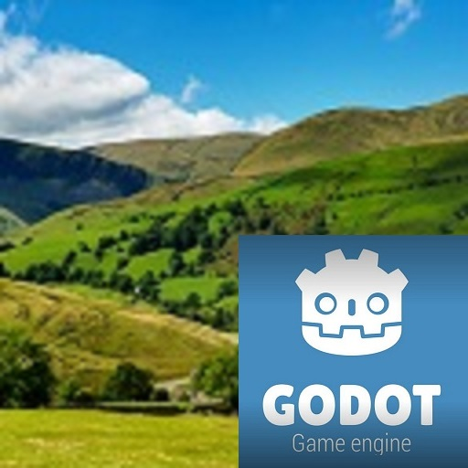

# Countryside - A Godot 4 demo

:warning: **WORK IN PROGRESS !!!**

The source code for my countryside demo scene. It's a short demo and test for open world (GTA) and level of details (LOD).

# Licenses
This demo was made using the **[Godot Engine](https://www.godotengine.org)** - [License Details](https://godotengine.org/license)

## **This project is dual-licensed**
### Code - **MIT**
The source code is MIT licensed.

### Art Assets (3D models, Audio files) - **CC-BY-4.0**

# Giving back

I use X/Twitter as my main account for game development related stuff, so I would be thankful for anyone following me 🎉

[**Damien on X/Twitter**](https://x.com/FremontGames)

And if you like, I will praise the dark lord ☕ every day and gladly accept your offerings to the shrine!

[**Buy Damien a Coffee**](https://www.buymeacoffee.com/damienfremont)
